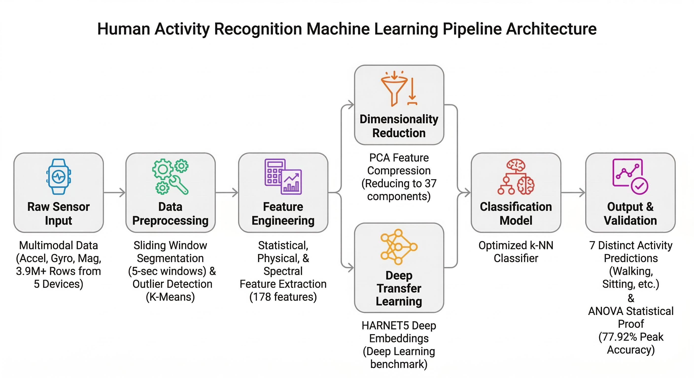

# Human Activity Recognition (HAR) Machine Learning Pipeline

## Project Description
Developed a robust machine learning pipeline to classify 7 physical human activities (such as walking, sitting, and climbing stairs) using the multimodal FORTH-TRACE wearable sensor dataset. This project focused on building a complete data lifecycle: from processing over 3.9 million temporal records across 5 body-worn devices to rigorous outlier detection, signal processing, and model classification.

I engineered a system that filtered sensor noise using dynamic K-Means clustering, IQR, and Z-score methods; extracted 178 custom features via 5-second sliding windows with 50% overlap, and applied PCA to compress the feature space into 37 principal components while retaining 75% of total variance. Since the focus was feature engineering and preprocessing, kNN was deliberately chosen as the classifier—its performance is directly tied to feature quality, making it an ideal probe for validating the pipeline.

**The Result:** The final optimized kNN achieved a peak accuracy of **77.92%**—far exceeding the majority-class baseline of ~18%, and competitive with traditional SVM approaches (~85%) without using raw signal sequences required by CNN/LSTM state-of-the-art models (~93%). Furthermore, through rigorous statistical testing (ANOVA, p < 0.001), I successfully proved that this handcrafted mathematical feature engineering statistically outperformed modern deep learning embeddings (`harnet5`) for this specific classification task.

---

## Table of Contents
1. [Project Description](#project-description)
2. [Architecture & Pipeline](#architecture--pipeline)
3. [Dataset](#dataset)
4. [Methodology & Technical Deep Dive](#methodology--technical-deep-dive)
5. [Key Results](#key-results)
6. [Tech Stack](#tech-stack)
7. [License](#license)
8. [Authors](#authors)

---

## Architecture & Pipeline

Below is the high-level architecture of the complete data lifecycle and classification pipeline.

---

## Dataset
This project utilizes the **FORTH-TRACE Benchmark Dataset** designed for human activity recognition. 
* **Scope:** 15 participants performing various daily activities.
* **Hardware:** 5 multimodal wearable sensors positioned on the wrists, chest, and legs.
* **Data Volume:** 3,930,873 rows combining accelerometer, gyroscope, and magnetometer readings along three axes.
* **Target Classes:** The model focuses on predicting 7 primary activities: *Stand, Sit, Sit and Talk, Walk, Walk and Talk, Climb Stairs, and Climb Stairs & Talk.*

---

## Methodology & Technical Deep Dive

### 1. Data Engineering & Preprocessing
Processed the massive dataset of raw sensor signals. Handled severe class imbalances (the minority class had a ratio of ~1:11.4 compared to the majority) using the **SMOTE** oversampling method in the deployed model to ensure fair decision boundaries.

### 2. Advanced Outlier Detection
Engineered a multi-method anomaly detection system to filter out sensor noise, capturing atypical behaviors without losing critical transition data:
* **Univariate Methods:** Evaluated using Interquartile Range (IQR) and Z-Score thresholds.
* **Multivariate Clustering:** Implemented K-Means clustering in the 3D space of sensor magnitudes, utilizing dynamic, activity-dependent thresholds ($\mu + k \cdot \sigma$) to identify true distributional extremes.

### 3. Feature Engineering
Extracted **178 highly discriminative features** using 5-second sliding windows (with 50% overlap). The feature set includes:
* **108 Statistical Descriptors:** Mean, Median, RMS, Kurtosis, Skewness, Zero Crossing Rate, Spectral Entropy, etc.
* **36 Correlation Features:** Inter-axis Pearson correlations measuring signal synchrony.
* **34 Physical & Spectral Metrics:** Signal Magnitude Area (SMA), Dominant Frequencies, and Eigenvalues of dominant directions.

### 4. Dimensionality Reduction & Feature Selection
Evaluated multiple feature selection algorithms to prevent the curse of dimensionality:
* **PCA (Principal Component Analysis):** Compressed the dataset into 37 components (retaining 75% variance).
* **Supervised Methods:** Utilized Fisher Score and ReliefF to rank the most critical features (e.g., Magnetometer Energy and RMS).

### 5. Deep Transfer Learning Benchmark
To validate the handcrafted features, I extracted deep learning embeddings using the pre-trained **`harnet5`** network (from the *ssl-wearables* project). This allowed for a direct benchmark between traditional explicit feature engineering and modern deep representation learning.

### 6. Rigorous Evaluation Setup
Designed strict data splitting strategies to accurately measure the model's ability to generalize:
* **Within-Subject Split:** (60/20/20) Ensures the model learns individual-specific movement patterns.
* **Between-Subject Split:** Segregates distinct individuals into Train/Val/Test groups to test generalization to completely unseen users without overfitting to specific biometric traits.

---

## Key Results

* **Top Configuration:** The Explicit Features Dataset utilizing *All Features* with a Within-Subject split yielded the highest performance metrics.
* **Performance:** Achieved **77.92% overall accuracy** and exceptional F1-scores (~0.97) for static activities like Standing and Sitting.
* **Statistical Superiority:** Hypothesis testing over 10 random Between-Subject splits (ANOVA: F=812.58, p=0.000; Kruskal-Wallis: p=0.00016) conclusively proved that the explicitly engineered features significantly outperformed the deep learning `harnet5` embeddings for this specific setup. 

*Full methodology, mathematical breakdowns, and confusion matrices are thoroughly documented in the `report.pdf`.*

---

## Tech Stack
* **Language:** Python
* **Data Manipulation:** Pandas, NumPy
* **Machine Learning:** Scikit-Learn (kNN, PCA, K-Means), Imbalanced-learn (SMOTE)
* **Statistical Analysis:** SciPy
* **Data Visualization:** Matplotlib, Seaborn
* **Deep Learning (Transfer):** `harnet5` network embeddings

---

## License
This project is licensed under the MIT License - see the [LICENSE](LICENSE) file for details.

---

## Authors
* **Pedro Silva** - pedrosilva222004@gmail.com
* **Ramyad Raadi** - uc2023205631@student.uc.pt

*Acknowledgments: FORTH-TRACE dataset creators and the developers of the ssl-wearables (`harnet5`) project.*
